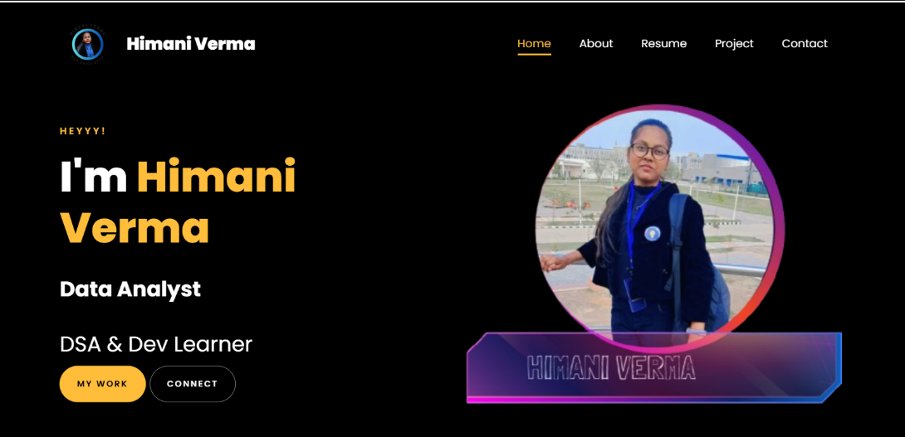

# 🌐 Portfolio Website

Welcome to my personal web portfolio — a creative space where I blend my **technical expertise**, **aesthetic vision**, and **personal space** to showcase who I am and what I do 💫

## 🚀 Live Website
[Visit Portfolio Website](https://himani-data.github.io/Portfolio/)  

---

## ✨ Features

- 🖼️ Smooth, scrollable sections (Hero, Projects, About Me, Contact)
- 🎯 Task Progress Tracker (To-Do App included!)
- 🌈 Canva-inspired gradient theme
- 📱 Fully responsive design (mobile-friendly)
- 🧘‍♀️ Reflects personal and spiritual essence

---

## 📸 Sneak Peek

  

---

## 🛠️ Tech Stack

| Frontend        | 
|-----------------|
| HTML5           | 
| CSS3            | 
| JavaScript      | 

---

## 📚 What I Learned

While building this website, I explored and applied:

- 🧠 **Semantic HTML & CSS**  
  Learned how to structure and style a professional layout from scratch.

- 🎨 **Bootstrap Framework**  
  Leveraged Bootstrap classes to speed up UI development and ensure responsiveness.

- 🧩 **JavaScript & DOM Manipulation**  
  Built interactive components like progress bars and animated scrolls using vanilla JS.

- 🌐 **Git & GitHub Workflow**  
  Practiced the full Git workflow: `init`, `add`, `commit`, `push`, setting remotes, and resolving errors like refspec mismatches.

- 🐛 **Debugging**  
  Solved real layout and version control issues — improving my patience and problem-solving mindset.

---

## 👤 About Me

Hi! I’m **Himani Verma**, a Computer Science student with a heart for **learning, coding, fixing**, and creative exploration.

🔗 [Connect with me on LinkedIn](https://www.linkedin.com/in/himaniverma2604/)  
📧 Reach me at: [25010247@scale.iitrpr.ac.in](mailto:25010247@scale.iitrpr.ac.in)

---
### 🎨 Credits

This site was built upon a publicly available template, modified and customized by me to suit my personal portfolio.

---

> “Exploring life between code, calmness, and the cosmic rhythm of devotion.” 🌼

